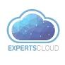

# ExpertsCloud


ExpertsCloud provides DevOps services for companies of all sizes. We ensure end-to-end software delivery automation, as well as security of infrastructure in the company.

Follow us on social media:

<a href="https://www.facebook.com/Expertscloud" target="_blank"></a>
<a href="https://www.linkedin.com/company/expertscloud-pvt-limited" target="_blank"></a>
<a href="https://www.instagram.com/lifeatexpertscloud/" target="_blank"></a>


# lambda-serverless-video-thumbnails

## Description
This Node.js Lambda function retrieves media information from a video stored in an S3 bucket, downloads a chunk of the video, and generates a thumbnail.


## Features
- Media Information Retrieval: Utilizes ffprobe to extract duration and size of the video.
- Thumbnail Generation: Creates a thumbnail at a specified time using ffmpeg.
- S3 Integration: Downloads a video chunk from an S3 bucket.
- Error Handling: Provides responses and error messages for different failure scenarios.
- File Handling: Saves the downloaded chunk and generated thumbnail locally.


## Getting Started

These instructions will help you set up and deploy the project on your local machine and in the cloud.

### Prerequisites

- [Node.js](https://nodejs.org/) installed
- [Serverless Framework](https://www.serverless.com/) installed
- npm (Node Package Manager) installed
- AWS account and AWS CLI configured (if deploying to AWS)
- Ensure that an S3 bucket is  created.

### Configure AWS CLI
```bash
aws configure
```
It will prompt you to enter the following information:

 - AWS Access Key ID: Your AWS access key.
 - AWS Secret Access Key: Your AWS secret key.
 - Default region name: The AWS region you want to use (e.g., us-east-1).

 ### Set Environment Variables
 ```bash
BUCKET_Name="your bucket name"
```

 ### IAM Role:
Create an IAM role with permissions to access S3 buckets, Lambda functions, API Gateway, and CloudWatch.

### Installation

1. Clone the repository:

```bash
git clone git@github.com:expertscloud/lambda-serverless-video-thumbnails.git
cd lambda-serverless-video-thumbnails
```

2. Install dependencies:
```bash
npm i
```
3. Configuration:
   Update 'serverless.yml' with your config:
   ```bash
   frameworkVersion: "your version"
    provider:
      name: aws
      runtime: your nodejs verison e.g nodejs20.x
      region: your region e.g us-east-1
      role: your aws role e.g arn:aws:iam::123:role/serverless-role
      ```

4. Deployment:
   ```bash
   sls deploy
   ```
